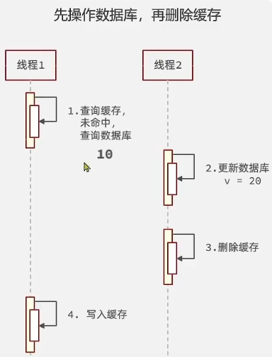

# 缓存

## 什么是缓存？

缓存就是数据交换的缓冲区，是存储数据的临时地方，一般读写性能比较高。

缓存的作用：

1. 降低后端负载。
2. 提高读写效率，降低响应时间。

缓存的成本：

1. 数据一致性成本。
2. 代码维护成本。
3. 运维成本。

## 缓存更新策略

### 内存淘汰策略

1. 说明：不用自己维护，利用redis的内存淘汰机制，内存不足时自动淘汰部分数据，下次查询时更新缓存
2. 一致性：差
3. 维护成本：无

### 超时剔除

1. 说明：给缓存添加ttl时间，时间到期后自动删除缓存，下次查询时更新缓存
2. 一致性：一般
3. 维护成本：低

### 主动更新

1. 说明：编写业务逻辑，在更新数据库数据时，同时更新缓存
2. 一致性：好
3. 维护成本：高

## 主动更新策略

主动更新策略的三个问题：

### 1. 删除缓存还是更新缓存？

删除缓存：更新数据库时，让缓存失效，查询时再更新缓存。

更新缓存：每次更新数据库都更新缓存，更新操作较多的时候，无效写操作比较多。

### 2. 如何保证缓存和数据库操作的同时成功或者失败？

单体架构：将缓存和数据库操作放到同一个事务中

分布式架构：利用TCC等分布式事务方案

### 3. 先操作缓存还是先操作数据库？

推荐先操作数据库再删除缓存，减少高并发下数据一致性问题。（无法避免线程安全问题，只不过这种方式出现的可能性比较低。）

## 缓存更新策略的最佳实践方案

1. 低一致性需求：使用redis自带的内存淘汰机制
2. 高一致性需求：主动更新，并以超时剔除作为兜底方案
   * 读操作：
     * 缓存命中则直接返回
     * 缓存未命中则查询数据库，并写入缓存，然后返回
   * 写操作：
     * 先更新数据库，然后删除缓存
     * 要确保数据库和缓存操作的原子性

## 缓存穿透

指客户端请求的数据在数据库和缓存中都不存在，这样缓存永远不会生效，这些请求最终都会打到数据库。

### 常见的两种解决方案

1. 缓存空对象
   1. 优点：实现简单，维护方便
   2. 缺点：额外消耗内存，数据短期不一致
2. 布隆过滤
   1. 优点：内存占用较少，没有多余的key
   2. 缺点：实现复杂，可能误判

## 缓存雪崩

指同一时间段大量缓存key同时失效或者redis集群宕机，导致大量的请求直接打到数据库。

### 解决办法

同一时间添加大量key时，ttl设置随机值，防止同时失效

利用redis集群提供服务的可用性

给缓存业务添加降级限流策略

给业务添加多级缓存

## 缓存击穿

缓存击穿问题也叫热点Key问题，就是一个被高并发访问并且缓存重建业务较复杂的key突然失效了，无数的请求访问会在瞬间给数据库带来巨大的冲击。

### 常见的两种解决方案

### 互斥锁

1. 优点：
   * 没有额外的内存消耗保证一致性
   * 实现简单
2. 缺点：
   * 线程需要等待，性能受影响
   * 可能有死锁风险

### 逻辑过期

1. 优点：
   * 线程无需等待，性能较好
2. 缺点：
   * 不保证一致性
   * 有额外内存消耗
   * 实现复杂
